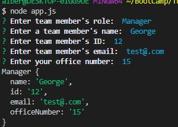
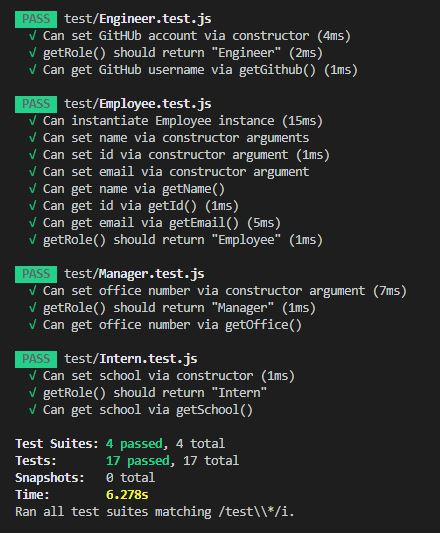

# Team-Profile-Generator

## Description 

This project involves generating software engineering team profiles using Node CLI. This prompts the user to input information about the team manager and team members, where they can input any number of members as well as mix the team with both interns and engineers. Once the team has been built, the applicaiton will create an HTML file that will display the roster based on the information provided. 

## Table of Contents

* [Installation](#installation)
* [Usage](#usage)
* [Tests](#tests)
* [Author](#author)

## Installation
Before installing this project, Node.js must be installed to run CLI.

Install the project using the following command: 
```javascript

npm i 

```
Dependencies included are `jest` and `inquirer`.

## Usage

Once installed, run ```node app.js``` through the terminal to run the project and input the answers accordingly:





After creating the desired amount of members, the console will prompt that the page has been created in the `output` folder named `team.html`.


## Tests 

To run tests, run the following command: 
```javascript

npm run test

```

`jest` will run tests in the application to ensure class syntax and constructor functions are working and so that the application will generate the html files accordingly.




## Author
[lu-gflores](https://github.com/lu-gflores)
